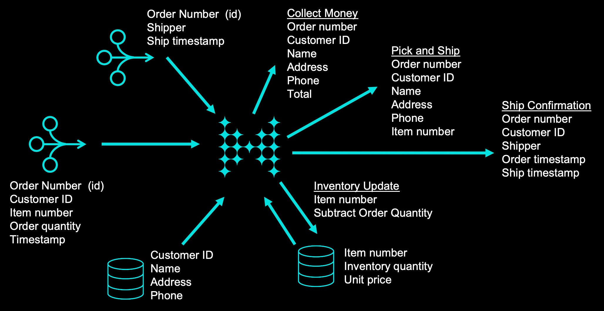
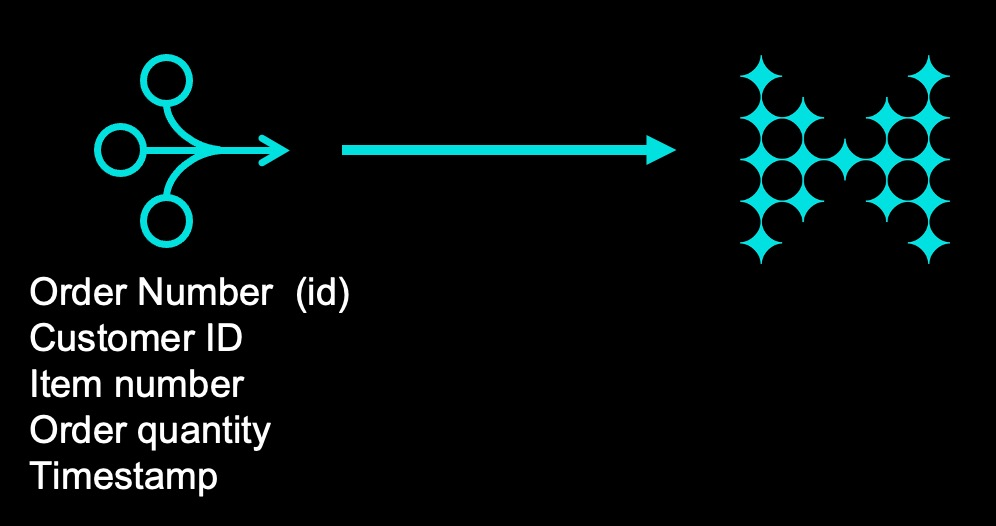
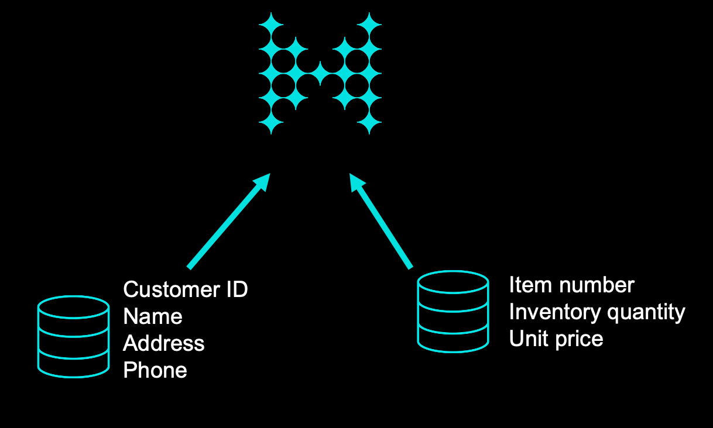
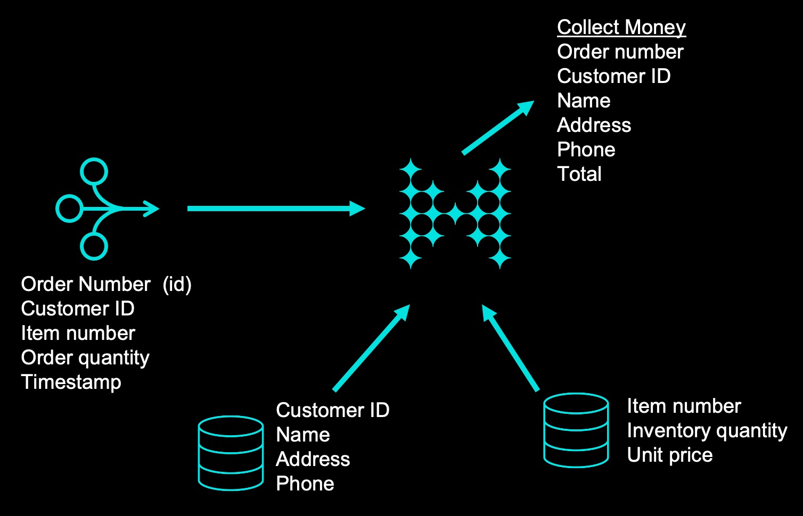

////
Make sure to rename this file to the name of your repository and add the filename to the README. This filename must not conflict with any existing tutorials.
////

// Describe the title of your article by replacing 'Tutorial template' with the page name you want to publish.
= Introduction to Stream Processing with Hazelcast
// Add required variables
:page-layout: tutorial
:page-product: cloud 
:page-categories: Stream Processing, SQL 
:page-lang: java, python
:page-enterprise: 
:page-est-time: 45 mins
:description: Use Hazelcast Viridian Cloud to process streaming data, enrich streaming data with data in fast storage, store output in fast storage, and use an entry processor to update inventory. 

{description}

// Give some context about the use case for this tutorial. What will the reader learn?
== Context



In this tutorial, you will build, step by step, a simple e-commerce order processing application. 

Step 1: Set up a streaming data source.
Step 2: Import customer and inventory databases.
Step 3: Generate pick-and-ship order
Step 4: Generate info for money collection
Step 5: Generate shipping confirmation
Step 6: Update inventory count

// Optional: What does the reader need before starting this tutorial? Think about tools or knowledge. Delete this section if your readers can dive straight into the lesson without requiring any prerequisite knowledge.
== Before you Begin

This tutorial is designed to be completed in conjunction with the Introduction to Stream Processing with Hazelcast course. Although you can complete this tutorial independently, the course provides operational context and additional information on Hazelcast. 

Before starting this tutorial, make sure that you meet the following prerequisites:

* https://docs.hazelcast.com/cloud/get-started[Set up a Viridian Cloud cluster]
* https://docs.hazelcast.com/clc/5.3/get-started[Connect the Command Line Client] or open the SQL tab for your cluster
* Download the repository at https://github.com/hazelcast-guides/Stream-Processing-Intro


== Step 1. Generate Streaming Data


[NOTE]
====
This lab uses SQL to simulate an external streaming data source. 
====

In this step, you will generate a stream of data using the Hazelcast SQL `generate-stream` function to create randomized customer order information.  




. Paste the following code into your SQL command line or Management Center SQL window. The code creates a view that is populated by randomly-generated data. 
+
```sql
CREATE OR REPLACE VIEW orders AS
  SELECT id,

       CASE WHEN orderRand BETWEEN 0 AND 0.2 THEN '11001'
            WHEN orderRand BETWEEN 0.2 AND 0.4 THEN '11002'
            WHEN orderRand BETWEEN 0.4 AND 0.6 THEN '11003'
            WHEN orderRand BETWEEN 0.6 AND 0.8 THEN '11004'
            ELSE '11005'
       END as cust_id, 

       CASE WHEN orderRand*1.5 BETWEEN 0 AND 0.25 THEN '501'
            WHEN orderRand*1.5 BETWEEN 0.25 AND 0.5 THEN '502'
            WHEN orderRand*1.5 BETWEEN 0.5 AND 0.75 THEN '503'
            ELSE '504'
       END as item_num,

       CASE WHEN orderRand*.66 BETWEEN 0 AND .25 THEN CAST(1 AS SMALLINT)
            WHEN orderRand*.66 BETWEEN .25 AND .5 THEN CAST(2 AS SMALLINT)
            ELSE CAST(3 AS SMALLINT)
       END as quantity,
       order_ts
FROM
    (SELECT v as id,
           RAND(v*v*v) as orderRand,
           TO_TIMESTAMP_TZ(v*10 + 1645484400000) as order_ts
     FROM TABLE(generate_stream(7))); 
```

. Verify that the view is generating data. Note that, because you are viewing a data stream, you will need to press CTRL-C to stop the query. 
+
```sql
SELECT * FROM orders;
```

. (Optional) Run additional queries, filtering on different fields or expected values. Example; 

+
```sql
SELECT * FROM orders
WHERE cust_id='11001';

```
STOP HERE IF YOU ARE TAKING THE INTRODUCTION TO STREAM PROCESSING CLASS! Watch the Fast Data Storage lesson before proceeding. 

== Step 2. Load Fast Data Store


[NOTE]
====
This lab uses SQL to insert data into the fast data store, simulating a data load from an external data source. 
====

In this step, you'll load the in-memory data stores that will be used for stream enrichment and for inventory tracking. 

. Create the mapping for the customer database, which will be stored in an IMap.
+
```sql
CREATE or REPLACE MAPPING customers (
     __key BIGINT,
     cust_id VARCHAR,
     last_name VARCHAR,
     first_name VARCHAR,
     address1 VARCHAR,
     address2 VARCHAR,
     phone VARCHAR )
TYPE IMap
OPTIONS (
'keyFormat'='bigint',
'valueFormat'='json-flat');
```
. Populate the `customers` map with data.
+
```sql
SINK INTO customers VALUES
(1, '11001', 'Smith', 'John', '123 Main St', 'Ames, IA 50012', '515-555-1212'),
(2, '11002', 'Li', 'Guo', '456 Powell St', 'San Francisco, CA 94108', '415-555-1212'),
(3, '11003', 'Ivanov', 'Sergei', '999 Brighton Blvd', 'New York, NY 11235','212-555-1212'),
(4, '11004', 'Mohammed', 'Ibrahim', '42 Elm St', 'Dearborn, MI 48126', '313-555-1212'),
(5, '11005', 'Patel', 'Ram', '5151 Market St', 'Trenton, NJ 08615', '609-555-1212');
```
. Verify that the data has been added to the `customers` map.
+
```sql
SELECT * FROM customers;
```
. Create the mapping for the inventory database, which will be stored in an IMap.
+
```sql
CREATE or REPLACE MAPPING inventory (
     __key BIGINT,
     item_num VARCHAR,
     unit_price DECIMAL,
     quantity SMALLINT)
TYPE IMap
OPTIONS (
'keyFormat'='bigint',
'valueFormat'='json-flat');
```
. Populate the `inventory` database.
+
```sql
SINK INTO inventory VALUES
(1, '501', 1.99, 500),
(2, '502', 3.99, 500),
(3, '503', 5.99, 500),
(4, '504', 7.99, 500);
```
. Verify that the data has been added to the `inventory` database.
+
```sql
SELECT * from inventory;
```

== Step 3: Generate Warehouse Pick Order



In this step, you will join the streaming order information with the customer shipping data to generate a pick and ship order for the inventory warehouse.

. Create an IMap to store pick order data.
+
```sql
CREATE OR REPLACE MAPPING PickOrder (
     __key BIGINT,
     ts TIMESTAMP,
     item_num VARCHAR,
     quantity SMALLINT,
     cust_id VARCHAR,
     last_name VARCHAR,
     first_name VARCHAR,
     address1 VARCHAR,
     address2 VARCHAR,
     phone VARCHAR)
TYPE IMap
OPTIONS (
'keyFormat'='bigint',
'valueFormat'='json-flat');
```
. Verify that the IMap has been created, but holds no data.
+
```sql
SELECT * FROM PickOrder;
```
. Join the streaming order data with the customer database to produce records to be added to the `PickOrder` IMap. Only add records if there are sufficient items in inventory.
+
The following fields will come from the `orders` stream
+
* Order ID (Use as __key for the IMap)
* Order timestamp
* Order item number
* Order quantity
* Customer ID
+
The following fields will come from the `customers` data store.
+
* Customer last name
* Customer first name
* Customer address line 1
* Customer address line 2
* Customer phone number
+
The common data field between `orders` and `customers` is `cust_id`.
+
The common data field between `orders` and `inventory` is `item_num`.

+
```sql
SELECT 
     ord.id AS __key,
     ord.order_ts AS ts,
     ord.item_num AS item_num,
     ord.quantity AS quantity,
     ord.cust_id AS cust_id,
     cust.last_name AS last_name,
     cust.first_name AS first_name,
     cust.address1 AS address1,
     cust.address2 AS address2,
     cust.phone AS phone
FROM orders AS ord
JOIN customers AS cust ON ord.cust_id = cust.cust_id
JOIN inventory ON ord.item_num = inventory.item_num
WHERE ord.quantity < inventory.quantity;
```
. Press CTRL-C to stop the join.

. Create a job that generates the PickOrder. Creating a job places the process into the background so it is running continuously without user intervention. 
+
```sql
CREATE JOB PickOrder AS
SINK INTO PickOrder
     SELECT 
          ord.id AS __key,
          ord.order_ts AS ts,
          ord.item_num AS item_num,
          ord.quantity AS quantity,
          ord.cust_id AS cust_id,
          cust.last_name AS last_name,
          cust.first_name AS first_name,
          cust.address1 AS address1,
          cust.address2 AS address2,
          cust.phone AS phone
     FROM orders AS ord
     JOIN customers AS cust ON ord.cust_id = cust.cust_id
     JOIN inventory ON ord.item_num = inventory.item_num
     WHERE ord.quantity < inventory.quantity;
```

. Verify that the `PickOrder` IMap now contains data.
+
```sql
SELECT * FROM PickOrder;
```
. From your Viridian Cloud console, monitor memory utilization. You should see it increasing.

. From Management Center, under Storage, select Maps. You should see the PickOrder map entries increasing.

. From Management Center, under Streaming, select Jobs. You should see the PickOrder job running. Select the job, then click the Suspend button to pause the job.


== Step 4: Generate Order Total


In this step, you will perform a three-way join with the streaming order information, the customer database, and the inventory database. The output includes a calculation of the amount due for the order, and is passed to an IMap. This map can then be read by a payment processing system. 

. Create a new IMap called `amount_due`.
+
```sql
CREATE OR REPLACE MAPPING amount_due(
     __key BIGINT,
    cust_id VARCHAR,
     last_name VARCHAR,
     first_name VARCHAR,
     address1 VARCHAR,
     address2 VARCHAR,
     phone VARCHAR,
     total DECIMAL)
TYPE IMap
OPTIONS (
    'keyFormat' = 'bigint',
    'valueFormat' = 'json-flat');
```
. Join the order stream and the customer database to generate the amount due information and publish it to the `amount_due` topic you just created.
+
```sql
CREATE JOB amount_due AS
SINK INTO amount_due
     SELECT 
          ord.id AS __key,
          ord.cust_id AS cust_id,
          cust.last_name AS last_name,
          cust.first_name AS first_name,
          cust.address1 AS address1,
          cust.address2 AS address2,
          cust.phone AS phone,
          (ord.quantity*inv.unit_price) AS total
     FROM orders AS ord
     JOIN customers AS cust ON ord.cust_id = cust.cust_id
     JOIN inventory AS inv ON ord.item_num = inv.item_num;
```

. Verify that data is being published to the `amount_due` map.
+
```sql
SELECT * FROM amount_due;
```

== Step 5 (Optional): Examine Java Pipelines

Download the entire repository from GitHub: https://github.com/hazelcast-guides/Stream-Processing-Intro. Under the Sample Pipelines directory, you will find sample code that performs the same functions as the two pipelines you created in SQL. The supporting classes are also included. 


== Summary

In this tutorial, you learned to:

* Generate data using SQL
* Perform basic SQL queries of both streaming data and data in Fast Storage
* Join stored data to streaming data to generate enriched output
* Use SQL to submit a job to the stream processing engine


== See Also

* http://training.hazelcast.com/introduction-to-stream-processing[The Introduction to Stream Processing with Hazelcast course]
* https://docs.hazelcast.com/hazelcast/5.3/pipelines/building-pipelines[Documentation on pipeline concepts]
* https://docs.hazelcast.com/hazelcast/5.3/sql/sql-overview[Documentation on Hazelcast's implementation of SQL]
